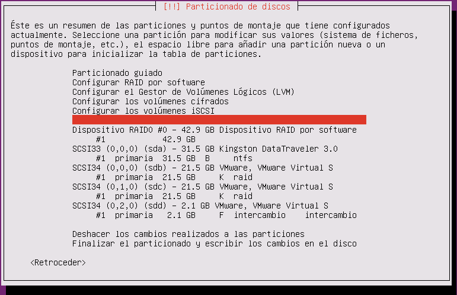
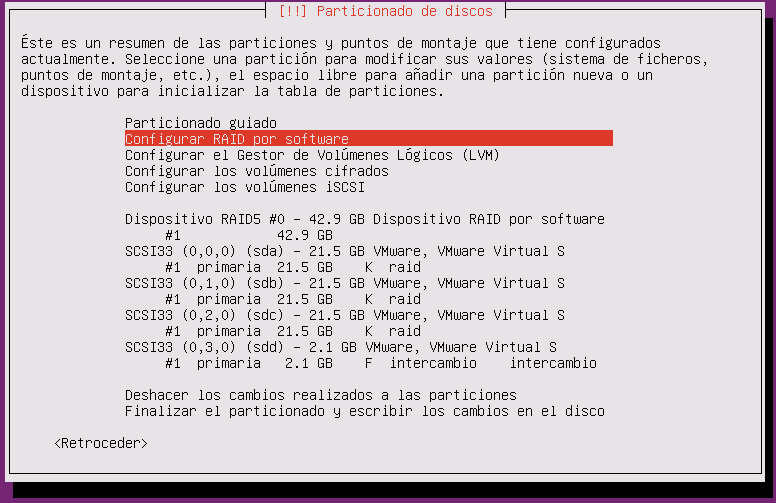

# Practica DNS-ROUTER

Crear un servidor DNS con las siguientes zonas:  
- sitioa.com  
  - www web con información de java.  
  - ftp servidor ftp.  
- sitiob.net
  - www web con información de C#  
  - ftp servidor ftp.
- sitioc.net
    - www web con información de Oracle.  
    - ftp servidor ftp.

~~~
#named.conf.local
zone "sitioa.com " {
        type master;
    file "/etc/bind/rd.sitioa.com ";
};

zone "sitiob.net " {
        type master;
    file "/etc/bind/rd.sitiob.net ";
};

zone "sitioc.net " {
        type master;
    file "/etc/bind/rd.sitioc.net ";
};

zone "5.168.192.in-addr.arpa" {
    type master;
        file "/etc/bind/r1.192.168.5";
};

#named.conf.options
options {
    directory "/var/cache/bind";

     forwarders {
            8.8.8.8;
        80.58.61.250;
     };

    dnssec-validation auto;

    auth-nxdomain no;    # conform to RFC1035
    listen-on-v6 { any; };
};

#rd.sitioa.com
$TTL 38400

@   IN  SOA server01.sitioa.com. correoadmin.sitioa.com. (
            2014092901
            28800
            3600
            604800
            38400 )

@ IN NS server01.sitioa.com.
server01.sitioa.com. IN A 192.168.5.20
www.sitioa.com. IN CNAME server01.sitioa.com.

#rd.sitiob.net
$TTL 38400

@   IN  SOA server02.sitiob.net. correoadmin.sitiob.net. (
            2014092901
            28800
            3600
            604800
            38400 )

@ IN NS server02.sitiob.net.
server02.sitiob.net. IN A 192.168.5.21
www.sitiob.com. IN CNAME server02.sitiob.net.

#rd.sitioc.net
$TTL 38400

@   IN  SOA server03.sitioc.net. correoadmin.sitioc.net. (
            2014092901
            28800
            3600
            604800
            38400 )

@ IN NS server03.sitioc.net.
server03.sitioc.net. IN A 192.168.5.22
www.sitioc.com. IN CNAME server03.sitioc.net.

#ri.192.168.5
$TTL 38400

@ IN SOA servidor01.dam1.com. correoadmin.dam1.com. (
    2014092900;  //num serie
    28800; //refresco
    3600;  //reintentos
    604800; //caducidad
        38400); // tiempo en caché

@ IN NS server01.
20 IN PTR server01.

@ IN NS server02.
21 IN PTR server02.

@ IN NS server03.
22 IN PTR server03.
~~~  
**Configuración router  **
Editamos el fichero sysctl.conf:
~~~
nano /etc/sysctl.conf
~~~
Y descomentamos:
~~~
net.ipv4.tcp_syncookies=1
~~~

Ahora a crear un archivo llamado router.sh y editar el siguiente contenido:
~~~
nano router.sh
~~~
~~~
#!/bin/bash
iptables -t nat -A POSTROUTING -o ens33 -j MASQUERADE
~~~
Y editamos el fichero /etc/rc.local para que el script se inicie al ejecutar el servidor añadiendo:
~~~
sh /home/usuario/router.sh
~~~
Raid 0:  
  
Raid 5:  

